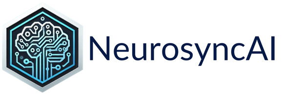

<!-- <div align="center">



</div> -->
<div align="center">
  
# ***InvoiceIQ - AI-Powered Invoice Data Extractor*** </t>

[](LICENSE)
[](https://www.python.org/downloads/)
[](https://streamlit.io)

</div>

## 🌟 Features

- **🤖 AI-Powered Extraction**: Intelligently extracts invoice data using multiple LLM providers.
- **🔌 Multi-Provider Support**: Choose between **Google Gemini**, **OpenAI (GPT)**, or local **Ollama** models.
- **🏠 Local LLM Support**: Process invoices 100% locally using Ollama for privacy and cost savings.
- **👁️ OCR Technology**: Tesseract OCR for accurate text extraction from PDF invoices.
- **💾 Database Management**: SQLite database for persistent storage and fast querying
- **🔍 Advanced Search**: Search by date range, company name with export to CSV/Excel
- **📊 Statistics Dashboard**: Real-time insights into invoice data
- **🎨 Modern UI**: Clean, professional Streamlit interface with dynamic model selection and progress indicators.
- **🐳 Docker Ready**: Containerized deployment with host machine connectivity for local models.
- **🔒 Secure**: Manage API keys directly in the UI; no hardcoded credentials.

## 📋 Table of Contents

- [Prerequisites](#prerequisites)
- [Installation](#installation)
- [Configuration](#configuration)
- [Model Selection](#model-selection)
- [Usage](#usage)
- [Docker Deployment](#docker-deployment)
- [Architecture](#architecture)
- [Troubleshooting](#troubleshooting)
- [Contributing](#contributing)
- [License](#license)

## 🔧 Prerequisites

Before you begin, ensure you have the following installed:

- **Python 3.11 or higher**
- **Tesseract OCR** ([Installation Guide](https://github.com/tesseract-ocr/tesseract))
  - Windows: Download from [GitHub releases](https://github.com/UB-Mannheim/tesseract/wiki)
  - macOS: `brew install tesseract`
  - Linux: `sudo apt-get install tesseract-ocr`
- **Poppler** (for PDF processing)
  - Windows: Download from [poppler releases](https://github.com/oschwartz10612/poppler-windows/releases)
  - macOS: `brew install poppler`
  - Linux: `sudo apt-get install poppler-utils`
- **Google Generative AI API Key** ([Get one here](https://makersuite.google.com/app/apikey))

## 📦 Installation

### Option 1: Standard Installation

1. **Clone the repository**
   ```bash
   git clone https://github.com/VinayakPunj/Invoice-Data-Extractor.git
   cd Invoice-Data-Extractor
   ```

2. **Create a virtual environment**
   ```bash
   python -m venv venv
   
   # Activate on Windows
   venv\Scripts\activate
   
   # Activate on macOS/Linux
   source venv/bin/activate
   ```

3. **Install dependencies**
   ```bash
   pip install -r requirements.txt
   ```

4. **Set up configuration** (see [Configuration](#configuration) section)

### Option 2: Docker Installation

See [Docker Deployment](#docker-deployment) section.

## ⚙️ Configuration

1. **Copy the environment template**
   ```bash
   cp .env.example .env
   ```

2. **Edit the `.env` file** with your settings:
   ```env
   # Required
   GOOGLE_API_KEY=your_google_api_key_here
   
   # Optional (defaults provided)
   TESSERACT_CMD=C:\Program Files\Tesseract-OCR\tesseract.exe  # Windows
   # TESSERACT_CMD=/usr/bin/tesseract  # Linux
   # TESSERACT_CMD=/usr/local/bin/tesseract  # macOS
   
   DATABASE_PATH=invoices.db
   LOG_LEVEL=INFO
   ```

3. **Verification** (Optional)
   ```bash
   python -c "from config import Config; print('Environment loaded!' if not Config.validate() else Config.validate())"
   ```

## 🤖 Model Selection

InvoiceIQ allows you to choose your preferred AI provider directly from the sidebar:

- **Google Gemini**: Reliable cloud-based extraction.
- **OpenAI**: Industry-standard GPT models.
- **Ollama**: Run open-source models (Llama 3, Gemma 2, etc.) locally on your machine.

> [!TIP]
> **Ollama Users**: Read the [Ollama Setup Guide](docs/OLLAMA_SETUP.md) for instructions on how to run and connect local models.

## 🚀 Usage

### Starting the Application

```bash
streamlit run app.py
```

The application will open in your default browser at `http://localhost:8501`

### Using the Application

#### 1. **Upload & Extract Invoices**

- Click "Upload & Extract Invoices" in the sidebar
- Upload one or more PDF invoice files
- The AI will automatically extract:
  - Company Name
  - Invoice Date
  - Total Amount
- Review and edit the extracted data if needed
- Click "Save to Database" to store the invoice

#### 2. **Search & Download Data**

- Click "Search & Download Data" in the sidebar
- View statistics: total invoices, total amount, unique companies
- Use filters to search:
  - Date range (from/to dates)
  - Company name (partial match)
- Export results as CSV or Excel


## 🐳 Docker Deployment

### Using Docker Compose (Recommended)

1. **Create `.env` file** with your configuration

2. **Start the application**
   ```bash
   docker-compose up -d
   ```

3. **Access the application** at `http://localhost:8501`

4. **View logs**
   ```bash
   docker-compose logs -f
   ```

5. **Stop the application**
   ```bash
   docker-compose down
   ```

### Using Docker Only

```bash
# Build
docker build -t invoice-extractor .

# Run
docker run -p 8501:8501 \
  -v $(pwd)/data:/app/data \
  -v $(pwd)/logs:/app/logs \
  -e GOOGLE_API_KEY=your_key_here \
  invoice-extractor
```


## 🏗️ Architecture

### Project Structure

```
Invoice-Data-Extractor/
├── src/                      # Source code modules
│   ├── __init__.py
│   ├── database.py          # Database operations
│   ├── ocr.py               # OCR processing
│   ├── llm.py               # LLM integration
│   ├── utils.py             # Utility functions
│   └── logger.py            # Logging configuration
├── tests/                   # Optional unit tests
├── docs/                    # Documentation
│   ├── ARCHITECTURE.md
│   ├── CONTRIBUTING.md
│   └── API.md
├── .github/
│   └── workflows/
│       └── ci.yml           # CI/CD pipeline
├── app.py                   # Main Streamlit application
├── config.py                # Configuration management
├── requirements.txt         # Python dependencies
├── Dockerfile              # Docker configuration
├── docker-compose.yml      # Docker Compose setup
└── .env.example            # Environment template
```

### Technology Stack

- **Frontend**: Streamlit
- **OCR**: Tesseract, pdf2image
- **AI**: Google Gemini, OpenAI (GPT), Ollama (Local)
- **Database**: SQLite
- **Data Processing**: Pandas
- **Containerization**: Docker

### Data Flow

1. **Upload** → PDF file uploaded via Streamlit UI
2. **OCR** → Tesseract extracts text from PDF pages
3. **AI Processing** → AI model analyzes text and extracts structured data
4. **Validation** → Data validation and date/amount parsing
5. **Storage** → Persisted to SQLite database
6. **Retrieval** → Search and export functionality

For detailed architecture documentation, see [docs/ARCHITECTURE.md](docs/ARCHITECTURE.md)

## 🐛 Troubleshooting

### Common Issues

#### Tesseract Not Found

**Error**: `TesseractNotFoundError`

**Solution**:
1. Verify Tesseract is installed: `tesseract --version`
2. Update `TESSERACT_CMD` in `.env` with correct path
3. Ensure Tesseract is in system PATH

#### Google API Key Error

**Error**: `Google API key is not configured`

**Solution**:
1. Get API key from [Google AI Studio](https://makersuite.google.com/app/apikey)
2. Add to `.env` file: `GOOGLE_API_KEY=your_key_here`
3. Restart the application

#### PDF Conversion Error

**Error**: `PDFInfoNotInstalledError`

**Solution**:
- Install Poppler (see [Prerequisites](#prerequisites))
- Ensure `poppler/bin` is in system PATH

#### LLM Model Not Found (404 Error)

**Error**: `404 models/gemini-1.5-flash is not found`

**Solution**:
1. Update to the latest model in `.env`:
   ```env
   LLM_MODEL=gemini-2.0-flash-exp
   ```
2. For Gemma models, ensure you use `models/` prefix:
   ```env
   LLM_MODEL=models/gemma-2-9b-it
   ```
3. See [docs/MODEL_CONFIG.md](docs/MODEL_CONFIG.md) for all available models

#### Database Locked

**Error**: `database is locked`

**Solution**:
- Close other connections to the database
- Check file permissions
- Use Docker volume for multi-user scenarios

### Logging

Check application logs for detailed error information:

```bash
# View logs
tail -f app.log

# Docker logs
docker-compose logs -f
```

## 🤝 Contributing

We welcome contributions! See [CONTRIBUTING.md](docs/CONTRIBUTING.md) for guidelines.

### Quick Start for Contributors

1. Fork the repository
2. Create a feature branch: `git checkout -b feature/amazing-feature`
3. Make your changes
4. Commit: `git commit -m 'Add amazing feature'`
5. Push: `git push origin feature/amazing-feature`
6. Open a Pull Request

## 📄 License

This project is licensed under the MIT License - see the [LICENSE](LICENSE) file for details.

## 🙏 Acknowledgments

- [Tesseract OCR](https://github.com/tesseract-ocr/tesseract) for OCR capabilities
- [Google Generative AI](https://ai.google.dev/) for intelligent data extraction
- [Streamlit](https://streamlit.io/) for the amazing UI framework

## 📧 Contact

**Vinayak Punj** - [@VinayakPunj](https://github.com/VinayakPunj)

Project Link: [https://github.com/VinayakPunj/Invoice-Data-Extractor](https://github.com/VinayakPunj/Invoice-Data-Extractor)

---

<div align="center">
Made with ❤️ by Vinayak Punj
</div>
